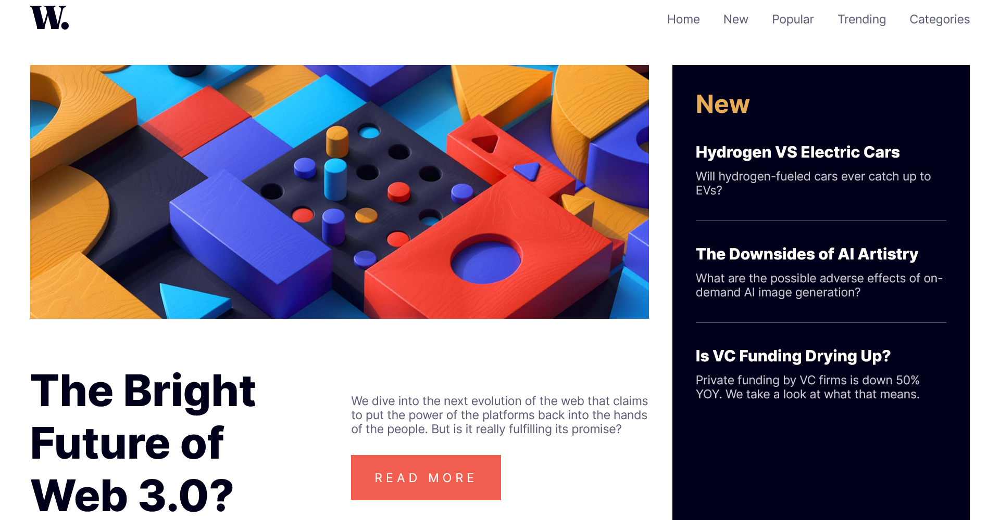

# Frontend Mentor - News homepage solution

My Solution of [News Homepage Challenge](https://www.frontendmentor.io/challenges/news-homepage-H6SWTa1MFl)by Frontend Mentor.

## Table of contents

- [Overview](#overview)
  - [The challenge](#the-challenge)
  - [Screenshot](#screenshot)
  - [Links](#links)
- [My process](#my-process)
  - [Built with](#built-with)
- [Author](#author)

## Overview

### The challenge

Users should be able to:

- View the optimal layout for the interface depending on their device's screen size
- See hover and focus states for all interactive elements on the page

### Screenshot

### Links

- Solution URL: [Add solution URL here](https://your-solution-url.com)
- Live Site URL: [Add live site URL here](https://your-live-site-url.com)

## My process

### Built with

- CSS Grids

## Author

- Website - [Federico Graziani](https://grazianifederico.it)
- Frontend Mentor - [@herecomesfed](https://www.frontendmentor.io/profile/herecomesfed)
